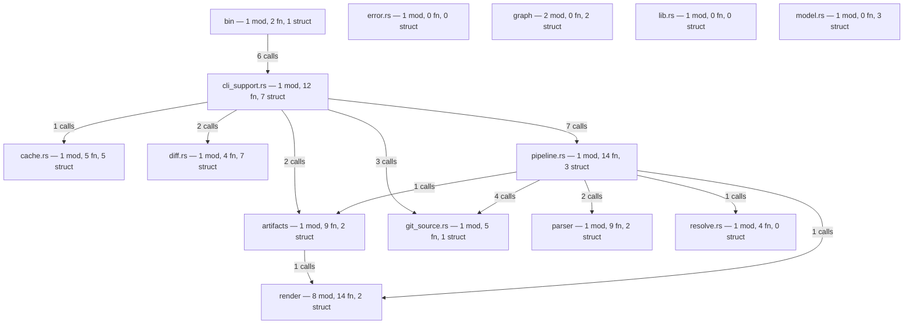
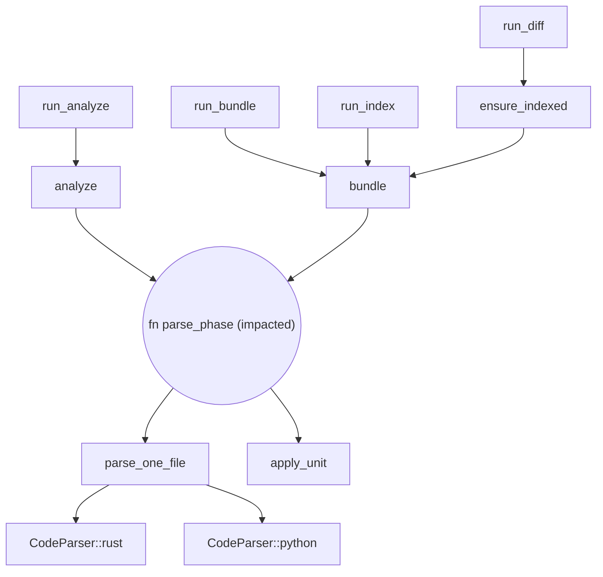
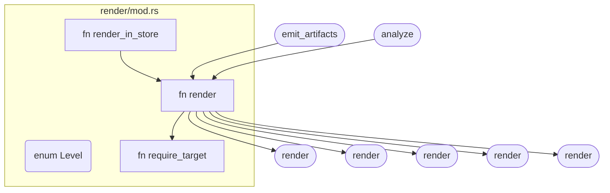
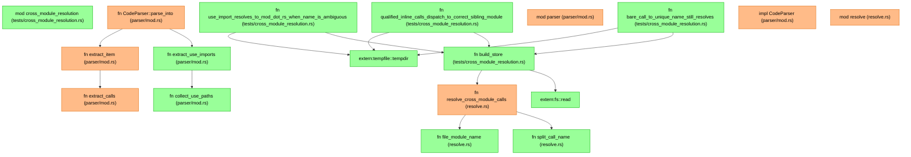
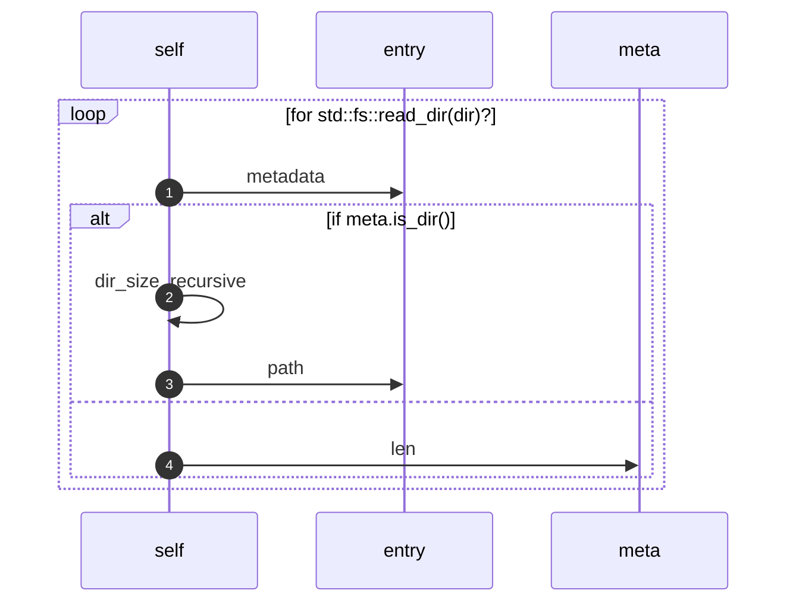
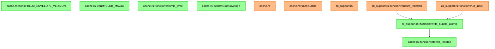

<div align="center">

# ast-to-mermaid

**Git-aware code-graph builder that turns a source tree into Mermaid diagrams.**

🌳 Rust · Python · Dart · 🔍 Five zoom levels · 💾 Cache-first

[](https://github.com/anatta-rs/ast-to-mermaid/actions/workflows/ci.yml)
[](https://crates.io/crates/ast-to-mermaid)
[](https://docs.rs/ast-to-mermaid)
[](https://crates.io/crates/ast-to-mermaid)
[](LICENSE)
[](https://www.rust-lang.org/)
[](CONTRIBUTING.md)

</div>

Tree-sitter-based code-graph builder that emits [Mermaid](https://mermaid.js.org/) diagrams at five zoom levels (project / overview / module / function / impact), plus a per-function `sequenceDiagram` view and a JSON artifact bundle suitable for downstream graph stores. **Git-aware**: render the graph at any ref, materialize per-commit bundles, diff structural changes between branches.

Supports **Rust, Python and Dart**.

Self-contained Rust crate. **No database, no graph backend, no async runtime, no in-house framework coupling** — just tree-sitter, serde, clap, plus the usual error/log helpers. Drop a path in, get a Mermaid string (or a directory of `.mmd` + `.meta.json` artifacts) out.

A content-addressed cache keyed on git blob SHA-1 makes branch switches cheap: 95%+ of files unchanged → parse skipped, **38× warm-path speedup** on rust-analyzer (1500 files).

## See it on real code

Every diagram below is real CLI output from this crate on its own `src/`. Long entity ids (which the CLI emits as `code_src_some_module_rs__function__foo`) are shortened to the trailing segment in some labels for visual breathing room — the structure, edges, and counts are unmodified.

### Bird's-eye: `a2m project ./src`

The whole crate at a glance — every top-level module + cross-module call counts:



(Note the `graph_` node id: the `graph/` module's name collides with Mermaid's `graph TD` keyword, so `sanitize_id` suffixes it with `_`. Without that escape, the diagram fails to parse — the same kind of reserved-keyword guard that pretty much every codegen tool that emits a target language has to deal with.)

### Convergence: `a2m impact ./src --target parse_phase`

How does a change to `pipeline::parse_phase` ripple? Both ways. Backward: it's an internal helper called by both `analyze` and `bundle`, which means **every** subcommand that hits the parse loop reaches it — with `run_diff` taking a two-hop detour via `ensure_indexed`. Forward: it fans out into the per-file parse machinery, down to the language frontends:



Every entry point converging on one impacted function above it, everything a change can break laid out below it. The kind of blast radius that turns "is it safe to refactor this?" into a 10-second answer.

### Dispatcher: `a2m module ./src --target render/mod.rs`

`render::render` is one function name shared by **six** modules. The resolver disambiguates via `use` imports + qualified call paths, so the dispatch fan-out and the two real callers land on the right node. Calls that stay inside the module (`render → require_target`) are drawn within the subgraph; methods inside `impl` blocks are first-class too — addressable via `--target Type::method` (e.g. `--target HnswBuilder::build`) without spelling out generic params:



Five zoom levels, one tool — `a2m overview` and `a2m function` aren't shown above but follow the same shape.

### Diff: `a2m diff <ref-a>..<ref-b>`

Set-diff between two cached bundles, coloured by change kind, with **edges drawn between changed entities** so you see the blast radius — not just *what* changed but *how the changes wire together*. Real output from `a2m diff 36f1585~..36f1585` on this very repo (the commit that taught the resolver to disambiguate cross-module calls via `use` imports + qualified paths):



`+11 -0 ~7 ↪0`. Two visual clusters wired together — exactly the shape of a "extract helpers + add test file" refactor:

- **Top half** is the production refactor: `parse_into` (modified) now calls `extract_use_imports` (new) which calls `collect_use_paths` (new). `resolve_cross_module_calls` (modified) gained two new helpers (`split_call_name`, `file_module_name`). Eight orange nodes, four green leaves.
- **Bottom half** is the test layer: `cross_module_resolution.rs` is a brand-new test file. Three of its tests share a `build_store` helper, which calls into `resolve_cross_module_calls` — that single edge is the bridge between the two clusters and tells you **the new test file actually exercises the new resolver code**, not some unrelated path.
- **Two extern atoms** appeared (`fs::read`, `tempfile::tempdir`) because the new test file pulls in two stdlib + dev-dep symbols not previously referenced anywhere.

The shape of the graph is the shape of the change. A pure bug fix would have one orange node and one edge to a green/red pair. A clean refactor would be all orange, no green/red. A feature drop with tests looks exactly like this — a tight production cluster bridged to a test cluster by one or two edges.

`--format json` returns a structured `BundleDiff` for downstream tooling. The rename heuristic pairs (removed, added) entries with identical `content_hash`. Auto-runs `a2m index` for any ref that isn't already cached.

### Order of operations: `a2m sequence ./src --target <fn>`

The other five views are unordered call graphs — they tell you *who calls whom*, not *in what order*. `a2m sequence` walks one function body in source order and emits a Mermaid `sequenceDiagram`: lifelines per receiver, arrows per call, control flow lifted into `alt` / `loop` blocks. It works on Rust, Python and Dart — `for`/`while`/`if`/`match`/`switch` lift to `loop`/`alt`, and postfix `.await` (Rust) as well as prefix `await` (Python, Dart) mark the async arrow. Dart cascades (`obj..a()..b()`) emit one call per link, and closures stay transparent: a call inside `items.forEach((e) { … })` is attributed to the enclosing function rather than a lifeline of its own. Take `dir_size_recursive` from this repo's cache module — 12 lines of Rust, a tree walk:

```rust
fn dir_size_recursive(dir: &Path) -> Result<u64> {
    let mut total = 0;
    for entry in std::fs::read_dir(dir)? {
        let entry = entry?;
        let meta = entry.metadata()?;
        if meta.is_dir() {
            total += dir_size_recursive(&entry.path())?;
        } else {
            total += meta.len();
        }
    }
    Ok(total)
}
```

`a2m sequence ./src --target dir_size_recursive` →



The whole algorithm in one glance: a `for` over directory entries, branching on `is_dir()` — the recursive call (the `self`-loop on step 3) versus the leaf-file path (`meta.len()`). The recursion is *visually* a self-arrow on the `self` lifeline; the `else` branch on a different lifeline (`meta`) makes the dir/file split obvious without reading the source.

Receiver classification is syntactic: `obj.method()` → `obj`, `Type::method()` → `Type`, bare ident → `self`. `.await` annotates the arrow. Test/panic plumbing (`assert!`, `Some`/`Ok` constructors, etc.) is filtered out as noise. Pass `--all --out <DIR>` to dump one `.mmd` per non-empty function across the tree.

## Install

```bash
cargo install ast-to-mermaid
```

That ships one binary, `a2m`, with eleven subcommands. Building from source works the same way:

```bash
cargo build --release
./target/release/a2m --help
```

## Quick start

```bash
# Birds-eye: every crate/module + cross-module call edges (working tree)
a2m project ./my-repo

# Same diagram at a specific git ref — reads via `git ls-tree` / `cat-file`,
# no checkout required.
a2m project ./my-repo --ref main
a2m project ./my-repo --ref v0.1.0
a2m project ./my-repo --ref HEAD~3

# One module's items + intra/cross-module calls
a2m module ./my-repo --target src/server/handlers.rs

# Reverse call chain into a function (who calls it?)
a2m function ./my-repo --target parse_config

# Methods on a type — `Type::method` shorthand handles generics for you
a2m function ./my-repo --target HnswBuilder::build

# One function's body as a Mermaid sequenceDiagram (statement order)
a2m sequence ./my-repo --target run_diff
# Or every non-empty function in the tree, one .mmd per fn
a2m sequence ./my-repo --all --out ./diagrams

# Forward + backward impact (3 hops by default)
a2m impact ./my-repo --target execute

# Write to a file instead of stdout
a2m project ./my-repo --out graph.mmd

# Emit Graphviz DOT instead of Mermaid — for graphs too big for browser
# renderers (GitHub caps at 500 edges, mermaid.live freezes around the
# same point). Pipe straight to dot/sfdp/twopi/circo:
a2m project ./my-repo --format dot | dot -Tsvg > graph.svg

# Materialize a full bundle for a ref into the cache (idempotent, re-runs
# print the cached path and exit instantly)
a2m index ./my-repo --ref main

# Structural diff between two refs — colour-coded Mermaid output
a2m diff main..feature

# Skip directories on top of the built-in (target, node_modules, .git, dotfiles)
a2m project ./my-repo --exclude vendor,generated

# See parse / resolve phase timings + cache hit ratio
a2m project ./my-repo --trace=info
```

## The eleven subcommands

| Subcommand | Output | Needs `--target` |
|---|---|---|
| `a2m project` | All crates + cross-crate call counts | no |
| `a2m overview` | Top-level modules + counts (fn / struct / trait) + cross-module edges | no |
| `a2m module` | One module's items + their callers/callees, both intra- and cross-module | yes — module path or stem |
| `a2m function` | A single function with its callers, walked back N hops | yes — function name |
| `a2m impact` | Forward + backward call chain from a function (default 3 hops) | yes — function name |
| `a2m sequence` | One function body as a Mermaid `sequenceDiagram` (statement order, lifelines per receiver) | yes — function name, or `--all` |
| `a2m walk` | List source files under a path (no parsing) — handy for shell pipelines | no |
| `a2m bundle` | Full 4-layer artifact bundle (`+ sequences/` with `--with-sequences`, see below) | no — needs `--out` |
| `a2m index` | Materialize a bundle for a git ref into the cache (`./.a2m/cache/refs/<sha>/`) | no — defaults to working tree |
| `a2m diff` | Set-diff between two cached bundles, colour-coded Mermaid or JSON | yes — `<ref-a>..<ref-b>` |
| `a2m gc` | Evict old / oversized cache entries by mtime + soft size cap | no |

The first eight accept `--ref <git-ref>` to read from any ref instead of the working tree. The last three accept `--cache-dir <path>` to relocate the cache and `--no-cache` to bypass it (ephemeral tempdir).

The five analyze-flavoured subcommands (`project`, `overview`, `module`, `function`, `impact`) also accept `--format <mermaid|dot>` — see [When the graph is too big for Mermaid](#when-the-graph-is-too-big-for-mermaid).

## When the graph is too big for Mermaid

Mermaid renders client-side via dagre. Browsers — and GitHub's markdown renderer — cap the input around **500 edges / 50 KB**. Past that, the diagram is structurally correct but unviewable: GitHub shows `Edge limit exceeded`, mermaid.live freezes, the SVG canvas comes back empty.

Graphviz handles 10k+ nodes fine. The `--format dot` flag emits DOT instead of Mermaid so you can pipe straight into the layout engine of your choice:

```bash
# Hierarchical (default — best for reading dependency chains)
a2m project ./my-repo --format dot | dot -Tsvg > graph.svg

# Force-directed (best for spotting clusters in a big graph)
a2m project ./my-repo --format dot | sfdp -Tsvg > graph.svg

# Radial (one central hub fans out)
a2m project ./my-repo --format dot | twopi -Tsvg > graph.svg
```

Install graphviz first (`brew install graphviz` / `apt install graphviz` / `choco install graphviz`).

What carries over: nodes, ids, edges, edge labels, `subgraph` boundaries (as DOT clusters). What doesn't: Mermaid-specific node shapes (hexagon for traits, cylinder for consts, …) collapse to DOT's default rectangle. The connectivity is preserved; the typographic hint is lost. That's the trade for *"the graph would otherwise be unviewable"*.

## The artifact bundle

`a2m bundle` writes a structured directory instead of a single Mermaid string — every entity gets its own `.mmd` and `.meta.json`, plus a master `index.json`:

```bash
a2m bundle ./src --out ./.artifacts
```

```
.artifacts/
├── overview.mmd                  # project-level diagram
├── index.json                    # schema=2, every entity (id, kind, content_hash, edges)
└── entities/
    ├── code_src_pipeline.rs.mmd                          # the module
    ├── code_src_pipeline.rs.meta.json                    #   ↳ children, hash, ...
    ├── code_src_pipeline.rs__function__analyze.mmd       # one function
    └── code_src_pipeline.rs__function__analyze.meta.json #   ↳ callers, callees, line range, signature, doc
```

Each `.meta.json` carries the entity's id, kind, file/line range, signature, doc, SHA-256 content hash, and the full edge surface — `callers`, `callees`, plus `implements` / `implemented_by` for impl/trait pairs. Calls into crates outside the analysed tree (e.g. `serde_json::to_string`, `divan::main`) become synthetic `extern:` atoms in the bundle so external dependencies are visible at the boundary instead of disappearing silently.

The bundle is plain JSON + Mermaid — load it into any graph store (Neo4j, DuckDB, in-memory) without re-parsing.

### Optional: per-function sequence diagrams

Pass `--with-sequences` and the bundle gains a fifth layer — one Mermaid `sequenceDiagram` per Rust function whose body has at least one call:

```bash
a2m bundle ./src --out ./.artifacts --with-sequences
```

```
.artifacts/
├── overview.mmd
├── index.json                    # function entries gain `sequence_path: "sequences/<id>.mmd"`
├── entities/...
└── sequences/
    └── code_src_pipeline.rs__function__analyze.mmd  # statement-order body view, lifelines per receiver
```

Off by default — extracting sequences re-parses every Rust file with the tree-sitter visitor and roughly doubles bundle wall-time. Functions with empty bodies (getters, `unimplemented!()`, doc-only stubs) are skipped, so the layer stays sparse on real codebases.

`content_hash` is the **git blob SHA-1** of the entity's source slice — the same value `git hash-object` produces. Cache keys, dedup across branches, and the `a2m diff` rename heuristic all rely on this identity.

## Git-aware mode + cache

`a2m` keeps a content-addressed cache at `<git-toplevel>/.a2m/cache/`. The directory is created on first run, gitignored automatically (single-line `.a2m/.gitignore` written if absent), and structured as:

```
.a2m/cache/
├── version                          # schema + grammar + a2m versions; mismatch wipes
├── blobs/
│   └── <git_blob_sha>.cbor          # parse output for one file blob
└── refs/
    └── <commit_sha or wt-digest>/   # one materialized bundle per ref
        ├── overview.mmd
        ├── index.json
        └── entities/...
```

Two layers, two payoffs:

- **`blobs/<sha>.cbor`** — per-file atom dedup. Switch branches → only the changed blobs need re-parsing. Measured 38× parse-phase speedup on rust-analyzer warm path.
- **`refs/<sha>/`** — whole-bundle reuse on identical refs. Re-running `a2m index` on a cached commit prints the path and exits in ~50 ms.

### Workflow examples

```bash
# CI: materialize once per commit, downstream jobs read the bundle directly
a2m index ./repo --ref "$GITHUB_SHA"
cp -r .a2m/cache/refs/"$GITHUB_SHA"/ ./pr-graph/

# Dev loop: see what changed structurally between two PR refs
a2m diff main..feature/cache-rewrite

# Trim the cache (default 1 GB soft cap)
a2m gc --max-size 500M --dry-run    # plan
a2m gc --max-size 500M              # execute

# Cold-path benchmark (no persistent cache)
a2m project ./repo --no-cache --trace=info
```

### Tracing

`--trace=info` emits structured per-phase timings:

```
INFO parse_phase{files=1464}: parse_phase done parsed=1464 atoms=15867 hits=1464 misses=0 elapsed_ms=42
INFO resolve_phase{atoms=15867}: resolve_phase done edges=5924 elapsed_ms=98
```

The `hits` / `misses` counters tell you exactly how much work the atom cache saved.

## Languages

- **Rust** — `tree-sitter-rust`
- **Python** — `tree-sitter-python`
- **Dart** — `tree-sitter-dart`

Anything else is silently skipped during the walk. The parser is **query-driven**: each supported language gets a small set of `.scm` tree-sitter query files in `src/parser/queries/<lang>/` (items, calls, imports, methods). Adding a language is roughly: add the `tree-sitter-<lang>` dep, drop the queries, add a `Language` enum variant.

Where a grammar disagrees with the others about *which field holds a label* — a `for`'s iterable is `value` in Rust, `right` in Python, and `value` again in Dart under Python's own `for_statement` kind — that read lives behind the `SeqLang` trait rather than in the walker. The rule when adding a fourth language: **if your handler reads a field name to build a label it belongs in `SeqLang`; if it only descends or emits a call it stays in the walker.**

Generated Dart (`.g.dart`, `.freezed.dart`, `.mocks.dart`, `.gr.dart`) is skipped by default — it was 27 % of the bytes on the reference corpus and carries no architectural signal.

## Use as a library

Add to your `Cargo.toml`:

```toml
[dependencies]
ast-to-mermaid = "0.2"
```

```rust
use ast_to_mermaid::artifacts::write_artifacts;
use ast_to_mermaid::pipeline::{AnalyzeOptions, analyze, bundle};
use ast_to_mermaid::render::Level;
use std::path::Path;

fn main() -> Result<(), Box<dyn std::error::Error>> {
    // Render a single Mermaid string at a given level.
    let mut opts = AnalyzeOptions::default();
    opts.level = Level::Overview;
    let report = analyze(Path::new("./my-repo"), &opts)?;
    println!("{}", report.mermaid);

    // Or build the full artifact bundle.
    let (artifacts, _report) = bundle(Path::new("./my-repo"), &AnalyzeOptions::default())?;
    write_artifacts(&artifacts, Path::new("./.artifacts"))?;
    Ok(())
}
```

Lower-level pieces are public for embedders that want to drive the pipeline by hand: `parser::{CodeParser, Language}`, `graph::Store`, `resolve::{resolve_cross_module_calls, resolve_implements_edges, EXTERN_KIND}`, `render::{render, Level}`, `pipeline::{bundle, DEFAULT_EXCLUDED_DIRS}`.

## How it works

```
collect inputs (FS walk OR `git ls-tree --full-tree <ref>`)
    └─ src/git_source  shell-out to git rev-parse / ls-tree / cat-file
    └─ src/cache       per-blob: blobs/<git_blob_sha>.cbor (cbor)
                       per-ref:  refs/<commit_sha>/ (full bundle)
    └─ src/parser      tree-sitter → ParseUnit { atoms, edges }
                       (intra-file Calls + Contains edges)
    └─ src/graph       in-memory Store<atoms, edges>
    └─ src/resolve     cross-module Calls edges (file-scope `use`
                       imports + qualified call paths to disambiguate
                       same-named functions across modules)
    └─ src/render      Mermaid string per zoom level
    └─ src/artifacts   emit_artifacts → ArtifactSet → write_artifacts
    └─ src/diff        compute_diff(BundleA, BundleB) →
                       BundleDiff (added/removed/modified/renamed)
                       + render_mermaid (colour-coded)
```

No async, no persistence layer, no graph backend. The cache is plain CBOR + JSON files on disk. The in-memory `Store` is a `RwLock<HashMap + Vec>` and lives for the duration of one CLI invocation.

## Quality gates

```bash
make check          # fmt + clippy (pedantic) + test
make ci             # check + coverage-gate
make coverage-gate  # fail if line coverage < 95 %
make hooks          # install pre-commit + pre-push hooks (.githooks/)
```

CI runs `make ci` on every PR. The coverage gate ignores `bin/*.rs` (thin wrappers — the library is what's tested).

### Dev environment

The toolchain those gates need is declared in [`repolith.toml`](repolith.toml) and installed by [repolith](https://github.com/anatta-rs/repolith):

```bash
repolith status    # what's missing, runs nothing
repolith sync      # install a2m + cargo-llvm-cov + cargo-semver-checks
```

`cargo-llvm-cov` is what `make coverage-gate` shells out to, and release-plz wants `cargo-semver-checks` on every release PR. One tool stays manual — `mmdc`, which repolith has no npm action for:

```bash
npm install -g @mermaid-js/mermaid-cli
```

It earns its place: `mmdc` catches diagrams that lint clean but fail to render, which a syntax check alone will not.

## Status

`v0.8.0` — git-aware, three languages. Eleven subcommands (seven render levels + `walk` / `index` / `diff` / `gc`), library API, artifact bundle, two-tier content-addressed cache keyed by git blob SHA-1. Tested on Rust crates from 6 to 1 463 files (rust-analyzer) and on Flutter projects up to 261 files; see [`docs/perf/2026-05-01-resolve-cost-baseline.md`](./docs/perf/2026-05-01-resolve-cost-baseline.md) for benchmarks.

Future work: parallel parse loop (`rayon`) for the cold path on large monorepos, optional V2 edge-level cache if `--trace=info` shows resolve-phase exceeding 30% of wall on real workloads (currently ≤ 7% even at rust-analyzer scale), a `--include-generated` flag to opt generated Dart back in, and merging Dart `part` / `part_of` files into their parent library.

## Examples (real output from this repo)

### Atom cache: cold → warm → one-file edit

`a2m project ./src --trace=info` on this crate, three runs back-to-back. Cache state is visible in `hits` / `misses`:

```text
# Run 1 — cold cache, every file is a miss
INFO parse_phase{files=22}: parse_phase done parsed=22 atoms=173 hits=0 misses=22 elapsed_ms=23
INFO resolve_phase{atoms=173}: resolve_phase done edges=50 elapsed_ms=0

# Run 2 — warm cache, every file replays from disk, parser skipped entirely
INFO parse_phase{files=22}: parse_phase done parsed=22 atoms=173 hits=22 misses=0 elapsed_ms=0
INFO resolve_phase{atoms=173}: resolve_phase done edges=50 elapsed_ms=0

# Run 3 — touched one file; only that blob is re-parsed, the other 21 are reused
INFO parse_phase{files=22}: parse_phase done parsed=22 atoms=173 hits=21 misses=1 elapsed_ms=1
INFO resolve_phase{atoms=173}: resolve_phase done edges=50 elapsed_ms=0
```

The pattern scales: on rust-analyzer (1 464 files / 570 k LOC) the warm parse-phase drops from 1 432 ms to 42 ms — **38× speedup** — see [`docs/perf/2026-05-01-resolve-cost-baseline.md`](./docs/perf/2026-05-01-resolve-cost-baseline.md).

### `a2m diff 0ee4cae..0ddc266` — the atomic-write commit

Real diff between two commits on the branch that built this README. The atomic-write commit added the `atomic_write` / `atomic_rename` helpers and the `write_bundle_atomic` CLI helper, then modified `ensure_indexed` and `run_index` to call into them:



The arrows tell the story directly: the two **modified** functions (orange) both gained calls into the new `write_bundle_atomic` helper (green), which in turn calls the new `atomic_rename` helper (green). Without the edges, the same diff is just a colour-coded list — useful but mute. With them, you see why the modifications happened. `+6 -0 ~5 ↪0`.

### `a2m diff v0.1.0..HEAD` — the entire git-aware journey

Stats for the cumulative diff between the last release and the head of this branch:

```
diff v0.1.0 → HEAD: +63 -24 ~45 ↪0
```

63 added entities (the new `cache`, `diff`, `git_source` modules + their public APIs + the new subcommand handlers), 24 removed (the FNV-1a `hex_sha256`, the seven separate binary entry points that got collapsed), 45 modified (every existing module gained `--ref` plumbing, the parser was refactored to expose `ParseUnit`, the artifact emitter now writes `content_hash`).

Drop the full Mermaid output into [mermaid.live](https://mermaid.live) to scroll the colour-coded entity list visually.

### `a2m index --ref` and re-runs

```text
$ a2m index ./repo --ref main
indexed 8209bc8315459f3534c501b0d1607d2b84470fcd → /repo/.a2m/cache/refs/8209bc8.../bundle (22 files, 153 atoms, 47 edges)

$ a2m index ./repo --ref main
cached 8209bc8315459f3534c501b0d1607d2b84470fcd → /repo/.a2m/cache/refs/8209bc8.../bundle

$ a2m index ./repo --ref main --force
indexed 8209bc8315459f3534c501b0d1607d2b84470fcd → /repo/.a2m/cache/refs/8209bc8.../bundle (22 files, 153 atoms, 47 edges)
```

Idempotent by default: re-runs on the same commit print the cached path and exit in milliseconds. `--force` re-materializes (e.g. after a parser version bump).

### `a2m gc` — pruning the cache

```text
$ a2m gc --max-size 100K --dry-run
would remove 1 entries (235830 bytes) from /repo/.a2m/cache (had 1 entries, 235830 bytes)

$ a2m gc --max-size 100K
removed 1 entries (235830 bytes) from /repo/.a2m/cache (had 1 entries, 235830 bytes)
```

Eviction is by mtime ascending until total size is under the cap. `--older-than 30d` adds an age filter on top.

## License

[Apache-2.0](./LICENSE)
