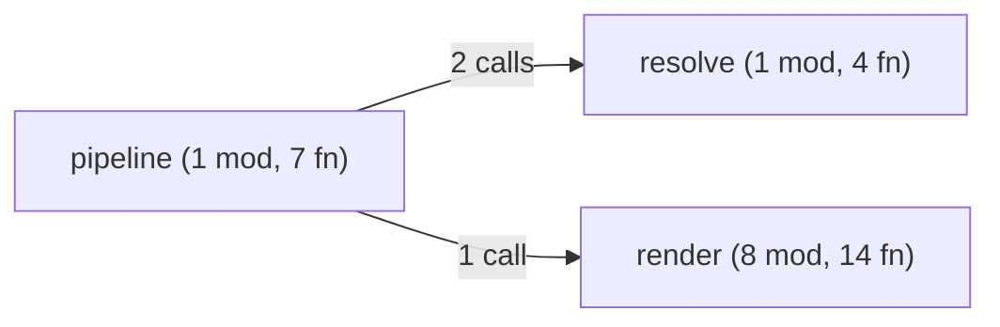

# ast-to-mermaid

Tree-sitter-based code-graph builder that emits [Mermaid](https://mermaid.js.org/) diagrams at five zoom levels, plus a JSON artifact bundle suitable for downstream graph stores.

Self-contained Rust crate — one in-memory graph, no external services, no database. Drop a path in, get a Mermaid string (or a directory of `.mmd` + `.meta.json` artifacts) out.

## What it produces



A diagram per zoom level, on demand, from any directory of `.rs` or `.py` source.

## Install

```bash
cargo install --path . --bins
```

This installs seven binaries: `a2m-project`, `a2m-overview`, `a2m-module`, `a2m-function`, `a2m-impact`, `a2m-walk`, `a2m-bundle`.

Or build without installing:

```bash
cargo build --release
ls target/release/a2m-*
```

## Quick start

```bash
# Birds-eye: every crate/module + cross-module call edges
a2m-project ./my-repo

# One module's items + intra/cross-module calls
a2m-module ./my-repo --target src/server/handlers.rs

# Reverse call chain into a function (who calls it?)
a2m-function ./my-repo --target parse_config

# Forward + backward impact (3 hops by default)
a2m-impact ./my-repo --target execute

# Write to a file instead of stdout
a2m-project ./my-repo --out graph.mmd

# Skip directories on top of the built-in (target, node_modules, .git, dotfiles)
a2m-project ./my-repo --exclude vendor,generated
```

## The five zoom levels

| Binary | Output | Needs `--target` |
|---|---|---|
| `a2m-project` | All crates + cross-crate call counts | no |
| `a2m-overview` | Top-level modules + counts (fn / struct / trait) + cross-module edges | no |
| `a2m-module` | One module's items + their callers/callees, both intra- and cross-module | yes — module path or stem |
| `a2m-function` | A single function with its callers, walked back N hops | yes — function name |
| `a2m-impact` | Forward + backward call chain from a function (default 3 hops) | yes — function name |

Plus `a2m-walk` — file-tree walker that lists source files (no parsing); useful as a building block for shell pipelines.

## The artifact bundle

`a2m-bundle` writes a structured directory instead of a single Mermaid string — every entity gets its own `.mmd` and `.meta.json`, plus a master `index.json`:

```bash
a2m-bundle ./src --out ./.artifacts
```

```
.artifacts/
├── overview.mmd                  # project-level diagram
├── index.json                    # every entity, edges, file pointers
└── entities/
    ├── code_src_pipeline.rs.mmd                          # the module
    ├── code_src_pipeline.rs.meta.json                    #   ↳ children, hash, ...
    ├── code_src_pipeline.rs__function__analyze.mmd       # one function
    └── code_src_pipeline.rs__function__analyze.meta.json #   ↳ callers, callees, line range, signature, doc
```

The bundle is the canonical input format for the [Anatta](https://github.com/anatta-rs) graph stack — load it into Neo4j without re-parsing.

## Languages

- **Rust** — `tree-sitter-rust`
- **Python** — `tree-sitter-python`

Anything else is silently skipped during the walk. Adding a language is a matter of wiring up one tree-sitter grammar in `src/parser/mod.rs`.

## Use as a library

Add to your `Cargo.toml`:

```toml
[dependencies]
ast-to-mermaid = "0.1"
```

```rust
use ast_to_mermaid::pipeline::{analyze, bundle, AnalyzeOptions};
use ast_to_mermaid::render::Level;
use std::path::Path;

// Render a single Mermaid string at a given level.
let report = analyze(
    Path::new("./my-repo"),
    &AnalyzeOptions {
        level: Level::Overview,
        ..Default::default()
    },
)?;
println!("{}", report.mermaid);

// Or build the full artifact bundle.
let (artifacts, _report) = bundle(Path::new("./my-repo"), &AnalyzeOptions::default())?;
ast_to_mermaid::artifacts::write_artifacts(&artifacts, Path::new("./.artifacts"))?;
```

Lower-level pieces are public for embedders that want to drive the pipeline by hand: `parser::CodeParser`, `graph::Store`, `resolve::resolve_cross_module_calls`, `render::render`.

## How it works

```
walk source tree
    └─ src/parser    tree-sitter → CodeAtom + intra-file Calls edges
    └─ src/graph     in-memory Store<atoms, edges>
    └─ src/resolve   cross-module Calls edges (uses file-scope `use`
                     imports + qualified call paths to disambiguate
                     same-named functions across modules)
    └─ src/render    Mermaid string per zoom level
    └─ src/artifacts emit_artifacts → ArtifactSet → write_artifacts
```

No async, no persistence layer, no graph backend. The store is a `RwLock<HashMap + Vec>` and lives for the duration of one CLI invocation. Each binary is a thin clap parser plus a call into the library.

## Quality gates

```bash
make check          # fmt + clippy (pedantic) + test
make ci             # check + coverage-gate
make coverage-gate  # fail if line coverage < 95 %
make hooks          # install pre-commit + pre-push hooks (.githooks/)
```

CI runs `make ci` on every PR. The coverage gate ignores `bin/*.rs` (thin wrappers — the library is what's tested).

## Status

`v0.1` — seven binaries, library API, artifact bundle. Stable shape; future work is mostly more languages and richer per-entity metadata.

## License

[Apache-2.0](./LICENSE)
