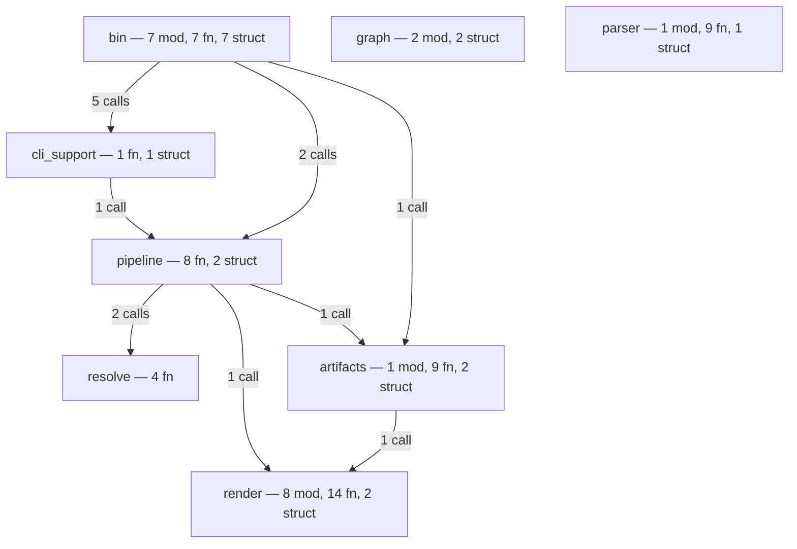
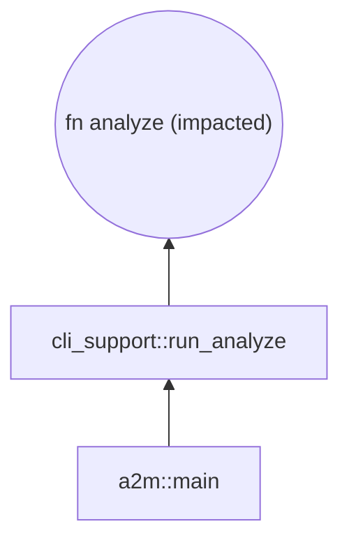
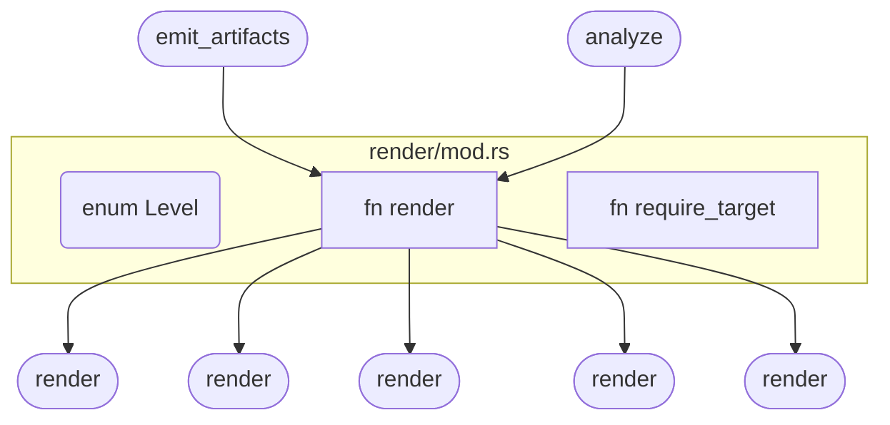

# ast-to-mermaid

Tree-sitter-based code-graph builder that emits [Mermaid](https://mermaid.js.org/) diagrams at five zoom levels, plus a JSON artifact bundle suitable for downstream graph stores.

Self-contained Rust crate. **No database, no graph backend, no async runtime, no in-house framework coupling** — just tree-sitter, serde, clap, plus the usual error/log helpers. Drop a path in, get a Mermaid string (or a directory of `.mmd` + `.meta.json` artifacts) out.

## See it on real code

Every diagram below was generated by running this crate on its own `src/` — no edits, no helpers.

### Bird's-eye: `a2m project ./src`

The whole crate at a glance — every top-level module + cross-module call counts:



### Convergence: `a2m impact ./src --target analyze`

How does a change to `pipeline::analyze` ripple outward? Three hops from `a2m::main`, through `cli_support::run_analyze`, into the core function — that's the whole blast radius:



### Dispatcher: `a2m module ./src --target render/mod.rs`

`render::render` is one function name shared by **six** modules. The resolver disambiguates via `use` imports + qualified call paths, so the dispatch fan-out and the two real callers land on the right node. Methods inside `impl` blocks are first-class too — addressable via `--target Type::method` (e.g. `--target HnswBuilder::build`) without spelling out generic params:



Five zoom levels, one tool — `a2m overview` and `a2m function` aren't shown above but follow the same shape.

## Install

```bash
cargo install ast-to-mermaid
```

That ships one binary, `a2m`, with seven subcommands. Building from source works the same way:

```bash
cargo build --release
./target/release/a2m --help
```

## Quick start

```bash
# Birds-eye: every crate/module + cross-module call edges
a2m project ./my-repo

# One module's items + intra/cross-module calls
a2m module ./my-repo --target src/server/handlers.rs

# Reverse call chain into a function (who calls it?)
a2m function ./my-repo --target parse_config

# Methods on a type — `Type::method` shorthand handles generics for you
a2m function ./my-repo --target HnswBuilder::build

# Forward + backward impact (3 hops by default)
a2m impact ./my-repo --target execute

# Write to a file instead of stdout
a2m project ./my-repo --out graph.mmd

# Skip directories on top of the built-in (target, node_modules, .git, dotfiles)
a2m project ./my-repo --exclude vendor,generated
```

## The seven subcommands

| Subcommand | Output | Needs `--target` |
|---|---|---|
| `a2m project` | All crates + cross-crate call counts | no |
| `a2m overview` | Top-level modules + counts (fn / struct / trait) + cross-module edges | no |
| `a2m module` | One module's items + their callers/callees, both intra- and cross-module | yes — module path or stem |
| `a2m function` | A single function with its callers, walked back N hops | yes — function name |
| `a2m impact` | Forward + backward call chain from a function (default 3 hops) | yes — function name |
| `a2m walk` | List source files under a path (no parsing) — handy for shell pipelines | no |
| `a2m bundle` | Full 4-layer artifact bundle (see below) | no — needs `--out` |

## The artifact bundle

`a2m bundle` writes a structured directory instead of a single Mermaid string — every entity gets its own `.mmd` and `.meta.json`, plus a master `index.json`:

```bash
a2m bundle ./src --out ./.artifacts
```

```
.artifacts/
├── overview.mmd                  # project-level diagram
├── index.json                    # every entity, edges, file pointers
└── entities/
    ├── code_src_pipeline.rs.mmd                          # the module
    ├── code_src_pipeline.rs.meta.json                    #   ↳ children, hash, ...
    ├── code_src_pipeline.rs__function__analyze.mmd       # one function
    └── code_src_pipeline.rs__function__analyze.meta.json #   ↳ callers, callees, line range, signature, doc
```

Each `.meta.json` carries the entity's id, kind, file/line range, signature, doc, SHA-256 content hash, and the full edge surface — `callers`, `callees`, plus `implements` / `implemented_by` for impl/trait pairs. Calls into crates outside the analysed tree (e.g. `serde_json::to_string`, `divan::main`) become synthetic `extern:` atoms in the bundle so external dependencies are visible at the boundary instead of disappearing silently.

The bundle is plain JSON + Mermaid — load it into any graph store (Neo4j, DuckDB, in-memory) without re-parsing.

## Languages

- **Rust** — `tree-sitter-rust`
- **Python** — `tree-sitter-python`

Anything else is silently skipped during the walk. The parser is **query-driven**: each supported language gets a small set of `.scm` tree-sitter query files in `src/parser/queries/<lang>/` (items, calls, uses, impl-methods). Adding a language is roughly: add the `tree-sitter-<lang>` dep, drop the queries, add a `Language` enum variant. No new walker code per language.

## Use as a library

Add to your `Cargo.toml`:

```toml
[dependencies]
ast-to-mermaid = "0.1"
```

```rust
use ast_to_mermaid::artifacts::write_artifacts;
use ast_to_mermaid::pipeline::{AnalyzeOptions, analyze, bundle};
use ast_to_mermaid::render::Level;
use std::path::Path;

fn main() -> Result<(), Box<dyn std::error::Error>> {
    // Render a single Mermaid string at a given level.
    let mut opts = AnalyzeOptions::default();
    opts.level = Level::Overview;
    let report = analyze(Path::new("./my-repo"), &opts)?;
    println!("{}", report.mermaid);

    // Or build the full artifact bundle.
    let (artifacts, _report) = bundle(Path::new("./my-repo"), &AnalyzeOptions::default())?;
    write_artifacts(&artifacts, Path::new("./.artifacts"))?;
    Ok(())
}
```

Lower-level pieces are public for embedders that want to drive the pipeline by hand: `parser::{CodeParser, Language}`, `graph::Store`, `resolve::{resolve_cross_module_calls, resolve_implements_edges, EXTERN_KIND}`, `render::{render, Level}`, `pipeline::{bundle, DEFAULT_EXCLUDED_DIRS}`.

## How it works

```
walk source tree                    [src/pipeline,  src/parser]
    │  (skips target/, node_modules/, __pycache__/, dist/, …
    │   plus dotfile dirs; symlink-loop safe)
    │
    └─ tree-sitter parse  →  CodeAtom per item
    │                         + intra-file Calls edges
    │                         + impl-method atoms (id = Type::method)
    │
    └─ Store<atoms, edges>          [src/graph]
    │
    └─ cross-module Calls           [src/resolve]
    │   from `use` imports + qualified paths;
    │   unresolved external calls → synthetic `extern:` atoms
    │
    └─ Implements edges             [src/resolve]
    │   `impl Trait for Type` linked to local trait atoms
    │
    └─ Mermaid render               [src/render]
    │   one renderer per zoom level
    │
    └─ Artifact bundle              [src/artifacts]
        overview.mmd + index.json + per-entity {.mmd, .meta.json}
```

No async, no persistence layer, no graph backend. The store is a `RwLock<HashMap + Vec>` and lives for the duration of one CLI invocation. The CLI is a single binary `a2m` with seven subcommands, each a thin clap parser plus a call into the library.

## Quality gates

```bash
make check          # fmt + clippy (pedantic) + test
make ci             # check + coverage-gate
make coverage-gate  # fail if line coverage < 95 %
make hooks          # install pre-commit + pre-push hooks (.githooks/)
```

CI runs `make ci` on every PR. The coverage gate ignores `bin/*.rs` (thin wrappers — the library is what's tested).

## Status

`v0.1` — single `a2m` binary with seven subcommands, library API, artifact bundle, query-driven parser for Rust + Python. Stable shape; future work is mostly more languages (cheap to add via `.scm` queries) and richer per-entity metadata.

## License

[Apache-2.0](./LICENSE)
