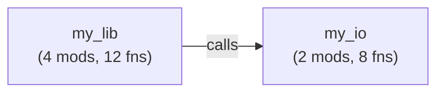

# ast-to-mermaid

Tree-sitter-based code graph + Mermaid renderer. Five zoom levels (project / overview / module / function / impact) for multi-language code analysis.

## Quick start

```bash
# Analyze a Rust project, output Mermaid
a2m-project ./my-rust-repo > graph.mmd

# Focus on a single module
a2m-module ./my-rust-repo src/lib.rs > module.mmd

# Show reverse call chain into a function
a2m-function ./my-rust-repo parse_config > callers.mmd

# Show forward + backward impact from a function
a2m-impact ./my-rust-repo execute > impact.mmd
```

Example Mermaid output:



## Five zoom levels

| Level | Binary | What it shows |
|-------|--------|---------------|
| **Project** | `a2m-project` | All crates/modules + cross-crate call edges (birds-eye) |
| **Overview** | `a2m-overview` | Top-level module structure with function/struct/trait counts |
| **Module** | `a2m-module <path>` | One module's items + intra-module calls + external callers/callees |
| **Function** | `a2m-function <name>` | Central function + direct callers (reverse chain, N hops) |
| **Impact** | `a2m-impact <name>` | Reverse + forward call chain from a function (default 3 hops) |

Plus `a2m-walk` — filesystem traversal helpers for integration scripts.

## Languages

- **Rust** (via tree-sitter-rust)
- **Python** (via tree-sitter-python)

Parsers provided by [ingester-code](https://github.com/anatta-rs/ingester-code).

## Architecture

```
ingester-code (tree-sitter)
         ↓
   CodeParser
         ↓
polystore::GraphStore<CodeAtom, CallEdge> (in-memory)
         ↓
   render per Level
         ↓
  Mermaid string
```

**Pipeline**: Parse directory → build in-memory graph via polystore traits → resolve cross-module calls → render at requested zoom level → emit Mermaid (stdout or file).

**No MCP server**: CLI-only architecture. One binary per analysis level (dispatch on `Level` enum).

## Workspace

| Crate | Type | Purpose |
|-------|------|---------|
| `ast-to-mermaid-core` | lib | Parser, renderer, resolver, in-memory store, public API |
| `ast-to-mermaid-cli` | bin | 6 verb-named binaries (a2m-*) |
| ~~`ast-to-mermaid-mcp`~~ | (dropped) | — |

The `core` crate is the only public lib; CLI is thin dispatch over `core::render::Level`.

## Status

`v0.2.x` shipped with 5 zoom levels + 6 binaries.

**Next major** (v0.3+): refactor to remove polystore internal dependency, emit rich 4-layer artifacts (AST → CFG → PDG → impact graph).

## Quality gates

- `make check` → cargo fmt + clippy (pedantic) + test
- `make coverage-gate` → enforces ≥ 95% line coverage
- CI: fmt, clippy, test, coverage + release-plz versioning

## License

[Apache-2.0](./LICENSE)
