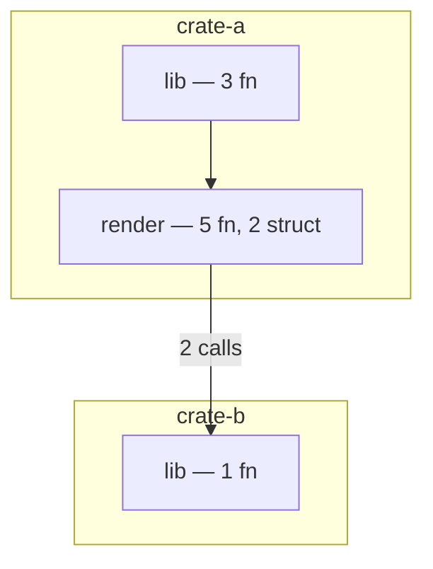

# ast-to-mermaid artifact bundle

_2026-05-01 · status: design_

## Why

`ast-to-mermaid` ships five Mermaid render levels (project, overview,
module, function, impact) — each produces **one** `.mmd` file at a
time. But every downstream consumer of the renderer (Anatta `attach`,
`mermaid-graph project`, future MCP clients, IDE integrations) wants
**the whole picture in one shot** : every module, every function,
their cross-refs, plus a registry telling them "what's in this
analysis?".

`mermaid-graph` already specifies a 4-layer bundle format (see
`mermaid-graph/src/artifacts.rs`). Its comment says the format
*"mirrors `ast_to_mermaid::artifacts::write_artifacts`"* — but that
producer side **does not exist yet**. This design fills the gap.

> **Acceptance** : after this work lands,
> `ast-to-mermaid bundle <repo> --out <dir>` produces a directory that
> `mermaid-graph project --artifacts <dir> --scope <ns>/<repo>/<branch>`
> ingests without errors.

## Bundle layout

```
<out-dir>/
  overview.mmd                    # top-level module-graph
  project.mmd                     # crate-level summary
  index.json                      # registry of every entity + cross-refs
  entities/
    <sanitized-id>.mmd            # one Mermaid file per entity
    <sanitized-id>.meta.json      # one metadata file per entity
```

Two new top-level files complement the registry :

- `overview.mmd` — already produced by the `Overview` renderer ; goes
  to the bundle root.
- `project.mmd` — already produced by `Project` ; same.

Every parsed atom (`module`, `function`, `struct`, `trait`, `impl`,
`enum`) gets its own per-entity pair under `entities/`. This is the
"vrai overview" : you don't lose detail when you zoom in, you just
read a different file.

### `<sanitized-id>` rule

Entity ids are arbitrary strings (`code:src/lib.rs::function::foo`)
but file names must be portable. Apply this map :

```rust
fn sanitize_id(id: &str) -> String {
    id.chars().map(|c| match c {
        c if c.is_ascii_alphanumeric() => c,
        '.' | '_' | '-' => c,
        _ => '_',
    }).collect()
}
```

Already implemented identically in `mermaid-graph`. Both sides MUST
keep it byte-identical so round-trip works.

## `index.json` schema

```json
{
  "schema_version": 1,
  "generated_at": "2026-05-01T12:34:56Z",
  "ast_to_mermaid_version": "0.4.0",
  "source_root": "/abs/path/to/repo",
  "stats": {
    "files_parsed": 42,
    "atoms_indexed": 318,
    "edges_resolved": 57
  },
  "entities": [
    {
      "id": "code:src/lib.rs::function::foo",
      "kind": "function",
      "name": "foo",
      "file": "src/lib.rs",
      "line_start": 10,
      "line_end": 25,
      "mmd_path": "entities/code_src_lib.rs__function__foo.mmd",
      "meta_path": "entities/code_src_lib.rs__function__foo.meta.json",
      "edges": {
        "out": [
          {"to": "code:src/lib.rs::function::bar", "kind": "calls"}
        ],
        "in": [
          {"from": "code:src/main.rs::function::run", "kind": "calls"}
        ]
      }
    }
  ]
}
```

### Why duplicate edges in index.json + meta.json?

- **`index.json` edges** are a **summary** for graph-level operations
  (mermaid-graph's projector iterates this list to build edges in
  Neo4j without opening every meta.json).
- **`meta.json` edges** are a **detailed view** with role / signature
  / line-number info for callers/callees. Bigger, slower to read.

Two passes, two costs. Stays cheap on the common path.

## `meta.json` schema

One file per entity. All fields required (use `""` / `[]` for
absent values — keeps mermaid-graph's deserializer happy and avoids
`Option` matching downstream).

```json
{
  "id": "code:src/lib.rs::function::foo",
  "kind": "function",
  "name": "foo",
  "file": "src/lib.rs",
  "line_start": 10,
  "line_end": 25,
  "signature": "pub fn foo(x: u32) -> Result<()>",
  "doc": "/// Increments x by one and returns Ok.",
  "content_hash": "sha256:abc123…",
  "callers": [
    {"id": "code:src/main.rs::function::run", "name": "run", "file": "src/main.rs", "line": 42}
  ],
  "callees": [
    {"id": "code:src/lib.rs::function::bar", "name": "bar", "file": "src/lib.rs", "line": 90}
  ],
  "children": [
    {"id": "code:src/lib.rs::struct::Local", "kind": "struct", "name": "Local"}
  ],
  "imports": [
    {"path": "std::collections::HashMap", "resolved_id": null}
  ],
  "imported_by": [
    {"id": "code:src/main.rs::module::main", "name": "main"}
  ]
}
```

Per-kind specialization :

| Kind        | Notable fields                                      |
|-------------|-----------------------------------------------------|
| `module`    | `children` lists every contained item              |
| `function`  | `callers` + `callees` populated                    |
| `struct`    | `children` lists fields + impls                    |
| `trait`     | `children` lists method signatures + implementors  |
| `impl`      | `children` lists methods ; `for_type` extra field  |
| `enum`      | `children` lists variants                          |

## `entities/<id>.mmd` content

Each entity .mmd is **self-contained** but small. The format is :

```mermaid
%% id: code:src/lib.rs::function::foo
%% kind: function
%% file: src/lib.rs:10-25
graph TD
    foo:::function["foo&lt;br/&gt;pub fn foo(x: u32) -&gt; Result&lt;()&gt;"]
    run:::external["run<br/>caller"] --> foo
    foo --> bar:::external["bar<br/>callee"]
    classDef function fill:#dfe7fd,stroke:#3851a4,stroke-width:1px
    classDef external fill:#f1f1f1,stroke:#888,stroke-dasharray:3
```

Headers (`%% id`, `%% kind`, `%% file`) are required — they let
mermaid-graph correlate the .mmd back to its meta.json without re-
parsing the path.

Per-kind conventions :

- **module** : a subgraph containing every child item (functions,
  structs, …) with `contains` edges. Rendered by the existing
  `module.rs` renderer with minor adaptations.
- **function** : the central node + 1-hop callers (above) + 1-hop
  callees (below). Rendered by `function.rs`.
- **struct/trait/impl/enum** : the central node + `uses` /
  `implements` / variant edges. **New renderers** (`struct.rs`,
  `trait.rs`, `enum.rs`).

## Top-level `overview.mmd`

Currently `overview.rs` produces the module-level view (`graph TD` +
one node per module + cross-module call edges). It stays the same —
just gets written to `<out-dir>/overview.mmd` instead of stdout.

**Improvement (PR 2)** : group modules into per-crate subgraphs to
recover the project structure visually. Mockup :



## CLI

New top-level command :

```
ast-to-mermaid bundle <path> [--out <dir>] [--exclude DIRS]
```

- `<path>` — repo root
- `--out` — output dir, default `./.atm-bundle`
- `--exclude` — same semantics as `analyze --exclude`

Existing `ast-to-mermaid analyze <path> --level <X>` keeps working
for one-off mermaid output. They share a common pipeline that walks
the repo once and populates the in-memory store ; `bundle` simply
runs every renderer + emits the bundle, while `analyze` runs one.

## Implementation phases

### PR 1 — Make the chain work (target: this week)

1. New module `crates/ast-to-mermaid-core/src/artifacts.rs`
   - `ArtifactDir`, `EntityArtifact`, `sanitize_id`, `write_artifacts`
   - Symmetrical to mermaid-graph's loader (round-trip test)
2. Pipeline extension : after `analyze`-style walk, expose
   `bundle(store, opts) -> Result<ArtifactDir>` that calls every
   renderer + collects per-entity meta.
3. CLI : `bundle` subcommand
4. Tests :
   - Round-trip with `mermaid-graph::artifacts::load_artifact_dir`
   - Smoke : produce a bundle for a fixture repo, run
     `mermaid-graph project --artifacts <dir> --scope x/y/z`,
     assert exit 0

**Out of scope for PR 1** : the per-kind specialised renderers
(struct/trait/enum) — fall back to a generic per-entity .mmd that
just shows the central node + its 1-hop neighbours (no kind-
specific styling). Good-enough for mermaid-graph to consume ; PR 2
makes the .mmd content rich.

### PR 2 — Rich content

1. Per-kind renderers : `render::struct`, `render::trait`,
   `render::enum` — one `.mmd` per entity styled by kind.
2. Overview rendered with per-crate subgraphs (mockup above).
3. Module renderer adds doc-comment headers and signature labels.

### PR 3 — Polish + cross-refs

1. Populate `imports` / `imported_by` (currently parser doesn't
   extract these — needs ingester-code work).
2. `signature` & `doc` per atom — augment ingester-code's metadata.
3. Edge `role` (e.g. `Result-wraps`, `arg-type`, `return-type`)
   on `uses` edges.
4. `--diff` mode : produce a bundle for changed files only (driven
   by the post-commit hook).

## Test strategy

### Unit

- `sanitize_id` round-trips through the full ASCII range
- `ArtifactDir::write` then `mermaid-graph::load_artifact_dir`
  returns a structurally identical `ArtifactDir`
- `index.json` schema validates against a checked-in JSON Schema
  (PR 1 ships the schema)

### Integration

- `bundle` against `tempfile`-backed fixture repos with mixed
  `.rs` / unrelated content
- E2E : `bundle` then `mermaid-graph project` (Neo4j-required, hence
  `#[ignore]`d) — asserts the projection lands real nodes and edges

### Coverage gate

Stays at ≥ 95% line coverage (existing CI rule). PR 1 introduces
~400 LOC of artifact code ; tests will add ~600 LOC.

## Forward compatibility

Schema versioning : `index.json` carries `schema_version: 1`. Future
field additions are backward-compatible (mermaid-graph ignores
unknown keys per `serde_json::Value` deserialization). **Breaking**
schema changes bump to `2` and ship as a separate PR with a
migration note in `CHANGELOG.md`.

`ast_to_mermaid_version` is recorded so consumers can detect
producer-side mismatches and fail clear.

## Open questions

1. **Where does the bundle live by default?** Anatta wants
   `~/.anatta/cache/<scope>/<commit>/` ; the IDE plugin will want
   `target/atm-bundle/`. Caller chooses via `--out` for now ; we
   could later add `bundle --cache-dir-from-cargo` shorthand.
2. **Diff bundles** — PR 3 ships `--diff <base-rev>`. Schema
   addition : `index.json["diff_base"]: <sha>`. Decide if a partial
   bundle is a full bundle minus untouched entities, or a delta
   format. Current preference : full bundle, mermaid-graph diffs
   server-side via existing `diff` subcommand.
3. **MCP exposure** — should the MCP server expose a `bundle` tool
   call returning the `ArtifactDir` JSON inline? Probably yes for PR
   2, gated on token budget. Out of scope for PR 1.

## Lineage

- Producer side gap discovered while wiring Anatta AS5 (`anatta
  attach <repo>` Phase 2 — should bootstrap-ingest the repo into the
  graph). The mermaid-graph artifact contract was the obvious
  consumer ; nothing produces the contract.
- Anatta's `feat/as5-hooks` ships hooks-only ; AS5b will wire
  `bundle` once this design lands as PR 1.
